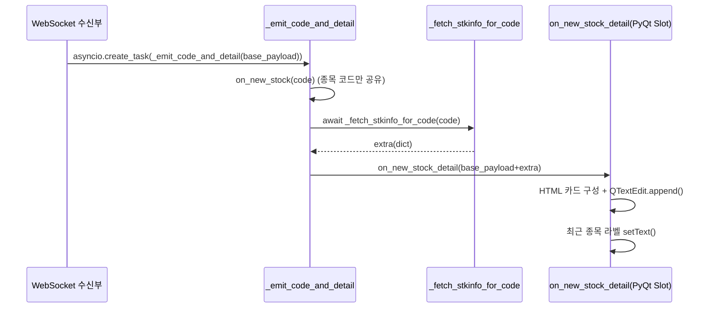
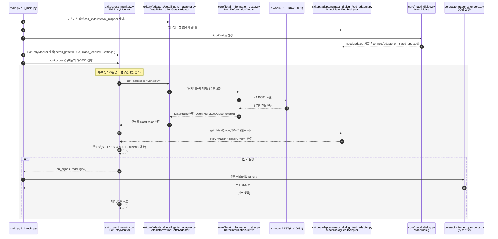
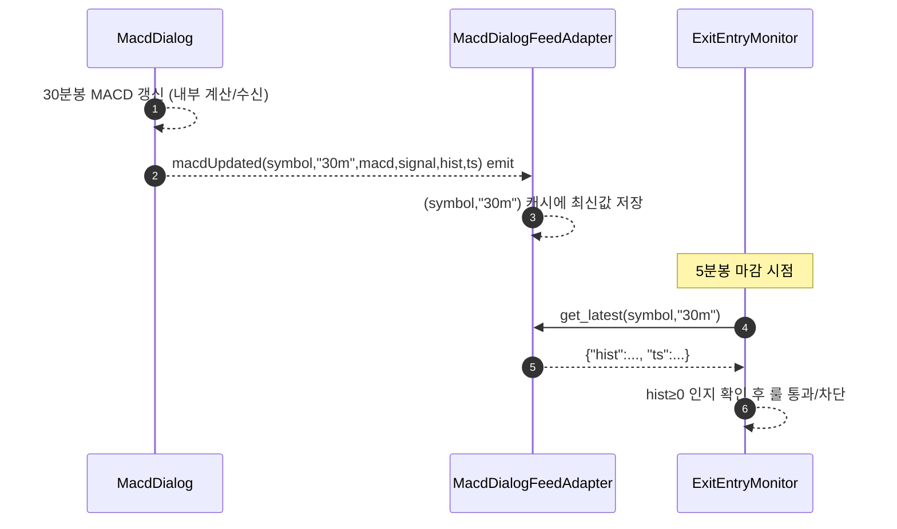

# AutoTrader

### 종목 검색 결과

```mermaid
sequenceDiagram
    participant WS as WebSocket 수신부
    participant PIPE as _emit_code_and_detail
    participant API as _fetch_stkinfo_for_code
    participant UI as on_new_stock_detail(PyQt Slot)

    WS->>PIPE: asyncio.create_task(_emit_code_and_detail(base_payload))
    PIPE->>PIPE: on_new_stock(code) (종목 코드만 공유)
    PIPE->>API: await _fetch_stkinfo_for_code(code)
    API-->>PIPE: extra(dict)
    PIPE->>UI: on_new_stock_detail(base_payload+extra)
    UI->>UI: HTML 카드 구성 + QTextEdit.append()
    UI->>UI: 최근 종목 라벨 setText()

```

### Exit pro

```mermaid
sequenceDiagram
    autonumber
    participant Main as main.py / ui_main.py
    participant Mon as exitpro/exit_monitor.py<br/>ExitEntryMonitor
    participant DIGA as exitpro/adapters/detail_getter_adapter.py<br/>DetailInformationGetterAdapter
    participant DIG as core/detail_information_getter.py<br/>DetailInformationGetter
    participant REST as Kiwoom REST(KA10081)
    participant MF as exitpro/adapters/macd_dialog_feed_adapter.py<br/>MacdDialogFeedAdapter
    participant MD as core/macd_dialog.py<br/>MacdDialog
    participant Trader as core/auto_trader.py or ports.py<br/>(주문 실행)

    Main->>DIGA: 인스턴스 생성(call_style/interval_mapper 세팅)
    Main->>MF: 인스턴스 생성(캐시 준비)
    Main->>MD: MacdDialog 생성
    MD-->>MF: macdUpdated 시그널 connect(adapter.on_macd_updated)
    Main->>Mon: ExitEntryMonitor 생성( detail_getter=DIGA, macd_feed=MF, settings )
    Main->>Mon: monitor.start() (비동기 태스크로 실행)

    rect rgb(245,245,245)
    note over Mon: 루프 동작(5분봉 마감 구간에만 평가)
    Mon->>DIGA: get_bars(code,"5m",count)
    DIGA->>DIG: (동기/비동기 매핑) 5분봉 요청
    DIG->>REST: KA10081 호출
    REST-->>DIG: 5분봉 캔들 반환
    DIG-->>DIGA: DataFrame 반환(Open/High/Low/Close/Volume)
    DIGA-->>Mon: 표준화된 DataFrame 반환
    Mon->>MF: get_latest(code,"30m") (필요 시)
    MF-->>Mon: {"ts", "macd", "signal", "hist"} 반환
    Mon-->>Mon: 룰판정(SELL/BUY & MACD30 hist≥0 옵션)
    alt 신호 발생
        Mon-->>Main: on_signal(TradeSignal)
        Main->>Trader: 주문 실행(키움 REST)
        Trader-->>Main: 주문 결과/로그
    else 신호 없음
        Mon-->>Mon: 대기/다음 루프
    end
    end
```

```mermaid
sequenceDiagram
    autonumber
    participant MD as MacdDialog
    participant MF as MacdDialogFeedAdapter
    participant Mon as ExitEntryMonitor

    MD-->>MD: 30분봉 MACD 갱신 (내부 계산/수신)
    MD-->>MF: macdUpdated(symbol,"30m",macd,signal,hist,ts) emit
    MF-->>MF: (symbol,"30m") 캐시에 최신값 저장

    Note over Mon: 5분봉 마감 시점
    Mon->>MF: get_latest(symbol,"30m")
    MF-->>Mon: {"hist":..., "ts":...}
    Mon-->>Mon: hist≥0 인지 확인 후 룰 통과/차단
```