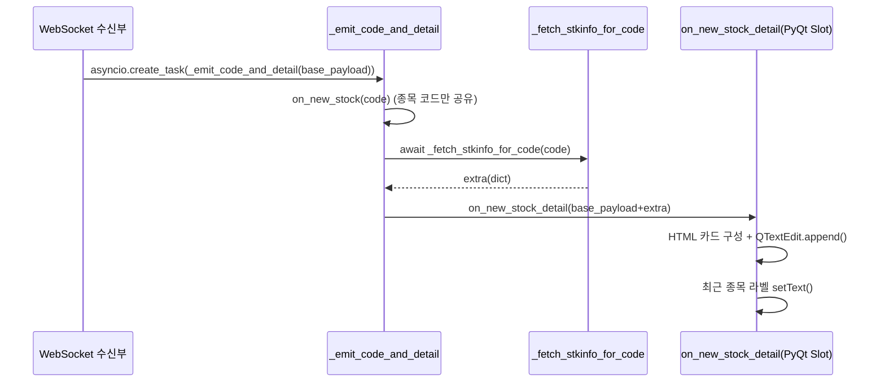

# AutoTrader

### 종목 검색 결과

```mermaid
sequenceDiagram
    participant WS as WebSocket 수신부
    participant PIPE as _emit_code_and_detail
    participant API as _fetch_stkinfo_for_code
    participant UI as on_new_stock_detail(PyQt Slot)

    WS->>PIPE: asyncio.create_task(_emit_code_and_detail(base_payload))
    PIPE->>PIPE: on_new_stock(code) (종목 코드만 공유)
    PIPE->>API: await _fetch_stkinfo_for_code(code)
    API-->>PIPE: extra(dict)
    PIPE->>UI: on_new_stock_detail(base_payload+extra)
    UI->>UI: HTML 카드 구성 + QTextEdit.append()
    UI->>UI: 최근 종목 라벨 setText()

```