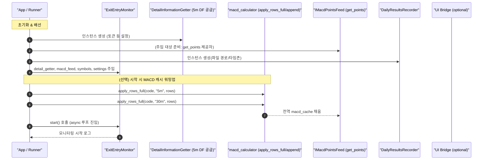
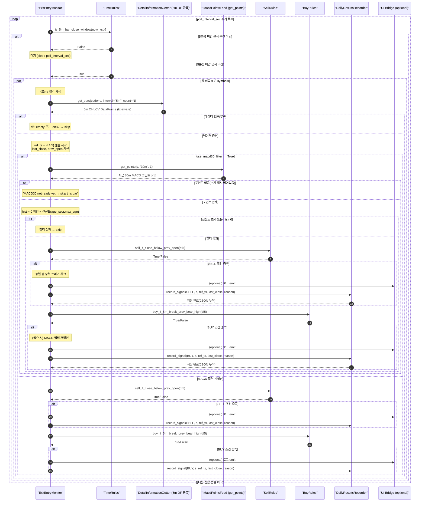

# 핵심 요약
### 역할: 5분봉 마감 근사 시각에 매수/매도 룰을 평가하고, 신호를 내보냅니다.

### 입력:

- DetailInformationGetter.get_bars(code, "5m", count) → tz-aware OHLCV DataFrame

- IMacdPointsFeed.get_points(symbol, "30m", 1) → 최근 30분 MACD 포인트(전역 MACD 캐시)

### 출력:

- on_signal(TradeSignal) 콜백 호출

- DailyResultsRecorder가 JSON(data/system_results_YYYY-MM-DD.json) 파일로 즉시 기록

### 보조 규칙:

- 동일 봉 중복 트리거 방지

- MACD 신선도 체크(기본 1800초)

- 초기 MACD 캐시 비어 있음 → 안전하게 skip 후 다음 사이클

# 구조 개요

## (1) 초기화/워밍업

## (2) 루프 내 흐름
