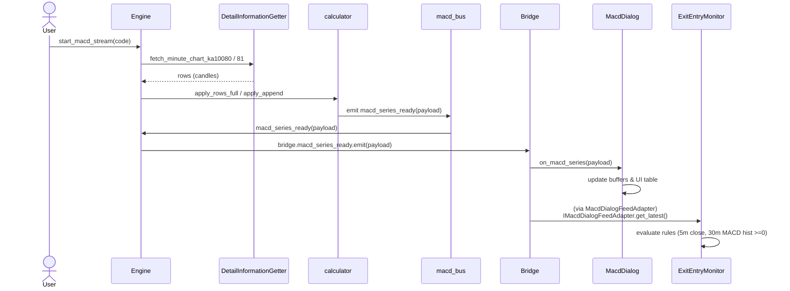

```mermaid
sequenceDiagram
    actor User
    User->>Engine: start_macd_stream(code)
    Engine->>DetailInformationGetter: fetch_minute_chart_ka10080 / 81
    DetailInformationGetter-->>Engine: rows (candles)
    Engine->>calculator: apply_rows_full / apply_append
    calculator->>macd_bus: emit macd_series_ready(payload)
    macd_bus->>Engine: macd_series_ready(payload)
    Engine->>Bridge: bridge.macd_series_ready.emit(payload)
    Bridge->>MacdDialog: on_macd_series(payload)
    MacdDialog->>MacdDialog: update buffers & UI table
    Bridge->>ExitEntryMonitor: (via MacdDialogFeedAdapter)<br>IMacdDialogFeedAdapter.get_latest()
    ExitEntryMonitor->>ExitEntryMonitor: evaluate rules (5m close, 30m MACD hist >=0)
```